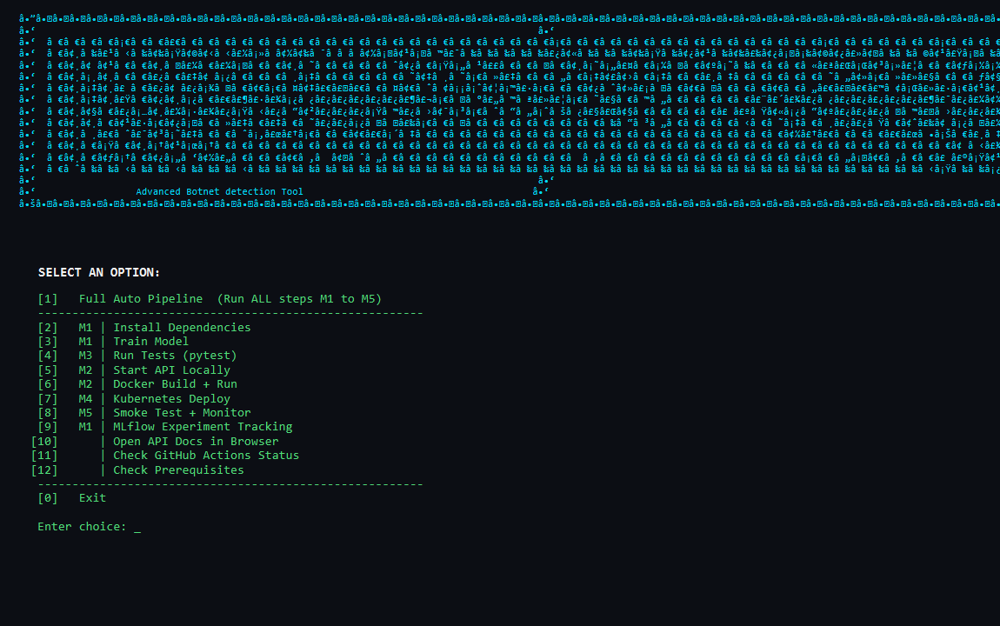

# Botnet Attack Detection — MLOps Pipeline

> End-to-end machine learning pipeline for detecting botnet attacks in IoT network traffic using the **UNSW-NB15** dataset. Follows a structured M1–M5 MLOps milestone framework.

[](https://github.com/Knight-Node64/Botnet-Attack-Detection/actions)




---

## Architecture

```
UNSW-NB15 Dataset
      │
      ▼
┌─────────────┐    ┌──────────────┐    ┌────────────────┐
│  M1: Train  │───▶│ M2: FastAPI  │───▶│  M3: CI Tests  │
│  (RF/XGB)   │    │  REST API    │    │  GitHub Actions│
└─────────────┘    └──────────────┘    └────────────────┘
                          │
              ┌───────────┴───────────┐
              ▼                       ▼
    ┌──────────────────┐   ┌──────────────────┐
    │  M4: Deploy      │   │  M5: Monitor     │
    │  Docker / K8s    │   │  Metrics & Logs  │
    └──────────────────┘   └──────────────────┘
```

---

## Quick Start

### 1. Install
```bash
git clone https://github.com/Knight-Node64/Botnet-Detection.git
cd Botnet-Detection
pip install -r requirements.txt
```

### 2. Add Dataset
Download [UNSW-NB15](https://www.kaggle.com/datasets/mrwellsdavid/unsw-nb15) and place in `dataset/`:
```
dataset/
  UNSW_NB15_training-set.csv
  UNSW_NB15_testing-set.csv
```

### 3. Train Model (M1)
```bash
python train_model.py
# → saves models/botnet_detector.joblib
```

### 4. Run API (M2)
```bash
uvicorn app:app --host 0.0.0.0 --port 8000
# → http://localhost:8000/docs  (Swagger UI)
```

### 5. Test (M3)
```bash
pytest -v tests/
```

### 6. Docker (M4)
```bash
docker build -t botnet-detector .
docker run -p 8000:8000 botnet-detector
```

### 7. Smoke Test / Monitor (M5)
```bash
python smoke_test.py             # verify API
python smoke_test.py --monitor   # live batch monitoring
```

---

## Model Performance

| Model        | Accuracy | Precision | Recall | F1-Score | ROC-AUC |
|:-------------|:--------:|:---------:|:------:|:--------:|:-------:|
| RandomForest | 88.6%    | 99.0%     | 83.4%  | **90.6%** | 98.8%  |
| XGBoost      | 88.4%    | 98.6%     | 83.6%  | 90.5%    | 98.4%   |

**Best model saved automatically** by F1-score.

---

## Project Structure

```
Botnet-Detection/
├── train_model.py          # M1 – Train & save model
├── app.py                  # M2 – FastAPI REST service
├── smoke_test.py           # M4/M5 – Smoke test & monitoring
├── requirements.txt        # Pinned dependencies
├── Dockerfile              # Container definition
├── docker-compose.yml      # Local orchestration
├── tests/
│   └── test_pipeline.py    # M3 – Unit tests (6 tests)
├── .github/
│   └── workflows/
│       └── ci-cd.yml       # M3 – GitHub Actions CI/CD
├── k8s/
│   ├── deployment.yaml     # M4 – Kubernetes Deployment
│   └── service.yaml        # M4 – Kubernetes Service
└── models/
    └── botnet_detector.joblib   # Saved model (git-ignored)
```

---

## API Reference

### `GET /health`
```json
{"status": "healthy", "model_loaded": true, "model_name": "RandomForest"}
```

### `POST /predict`
Send a network flow object, receive a classification:
```json
{
  "prediction": 1,
  "label": "Attack",
  "attack_probability": 0.9823,
  "latency_ms": 2.1
}
```

### `GET /metrics`
```json
{"total_requests": 42, "attacks_detected": 10, "normal_flows": 32, "avg_latency_ms": 2.3}
```

---

## MLOps Milestones

| # | Milestone | Files |
|---|-----------|-------|
| M1 | Model Training & Feature Engineering | `train_model.py` |
| M2 | Model Packaging & REST API | `app.py`, `Dockerfile` |
| M3 | CI Pipeline (Build, Test, Image) | `tests/`, `.github/workflows/` |
| M4 | CD Pipeline & Deployment | `docker-compose.yml`, `k8s/` |
| M5 | Monitoring & Logging | `smoke_test.py --monitor` |

---

## Feature Engineering (8 new features + 10 log transforms)

| Feature | Description |
|---------|-------------|
| `total_bytes` | `sbytes + dbytes` |
| `total_pkts` | `spkts + dpkts` |
| `bytes_per_pkt_src/dst` | Packet size symmetry |
| `pkt_ratio` / `byte_ratio` | Traffic asymmetry |
| `ttl_diff` | TTL field difference |
| `tcp_handshake` | `synack + ackdat` |
| `log_*` | Log1p transform on 10 skewed columns |
